```python
import scomv
import stlearn as st
import matplotlib.pyplot as plt
import matplotlib.patches as mpatches
import cv2
import pandas as pd
import numpy as np
import anndata
import scanpy as sc
```


```python
# Download tutorial dataset
#!mkdir tutorial_data
#!mkdir tutorial_data/xenium_data
#!wget -P tutorial_data/xenium_data/ https://cf.10xgenomics.com/samples/xenium/preview/Xenium_FFPE_Human_Breast_Cancer_Rep1/Xenium_FFPE_Human_Breast_Cancer_Rep1_cell_feature_matrix.h5
#!wget -P tutorial_data/xenium_data/ https://cf.10xgenomics.com/samples/xenium/preview/Xenium_FFPE_Human_Breast_Cancer_Rep1/Xenium_FFPE_Human_Breast_Cancer_Rep1_cells.csv.gz
```

```python
# Load Xenium data using stlearn
adata = st.ReadXenium(
    feature_cell_matrix_file="../tutorial_data/xenium_data/Xenium_FFPE_Human_Breast_Cancer_Rep1_cell_feature_matrix.h5",
    cell_summary_file="../tutorial_data/xenium_data/Xenium_FFPE_Human_Breast_Cancer_Rep1_cells.csv.gz",
    library_id="example data",
    image_path=None,
    scale=1,
    spot_diameter_fullres=10
)
```


```python
# Gridding at 10μm interval using stlearn
N_COL = int((adata.obs.imagecol.max() - adata.obs.imagecol.min()) / 10)
N_ROW = int((adata.obs.imagerow.max() - adata.obs.imagerow.min()) / 10)
grid = st.tl.cci.grid(adata, n_row=N_ROW, n_col=N_COL, n_cpus=48, verbose=False)
```

    OMP: Info #276: omp_set_nested routine deprecated, please use omp_set_max_active_levels instead.


```python
from scomv.preparation.skny_calc_distance import calculate_distance
```


```python
## apply SKNY
grid = calculate_distance(
    grid, pos_marker_ls=['CDH1',"EPCAM"],
)
```


```python
# Figure 2B
fig, ax = plt.subplots(figsize=(8, 6), dpi=150)
ax.imshow(cv2.cvtColor(grid.uns["marker_median_delineation"], cv2.COLOR_BGR2RGB),
          interpolation="nearest")
ax.axis("off")
plt.show()

#plt.savefig("Figure_2B.png", dpi=300)
```


    
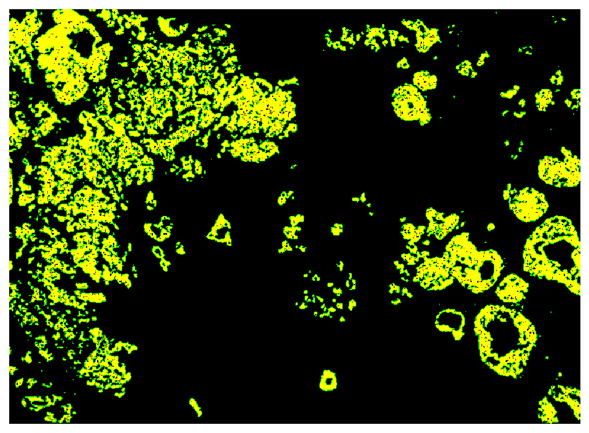
    


```python
# annotation each section to obs object
df_shotest = getattr(grid, "shortest")
df_grid = grid.to_df()

# extract grid info
df_grid = pd.merge(
    pd.DataFrame(index=["grid_" + str(i+1) for i in range(N_ROW * N_COL)]),
    df_grid, right_index=True, left_index=True, how="left"
).fillna(np.nan)

# extract section info
df_region = pd.DataFrame(
    np.array(df_shotest["region"]).reshape(N_ROW, N_COL).T.reshape(N_ROW * N_COL),
    index=["grid_" + str(i+1) for i in range(N_ROW * N_COL)], columns=["region"]
)

# marge
df_grid_region = pd.merge(
    df_grid, df_region,
    right_index=True, left_index=True, how="left"
)
df_grid_region = df_grid_region.dropna()

# add to obs
grid.obs = pd.merge(
    grid.obs, df_grid_region[["region"]],
    right_index=True, left_index=True, how="left"
)

# shaping
grid.obs["region_10"] = [str(i*10) for i in grid.obs["region"]]
grid.obs["region_10"] = ["("+str(int(float(i.split(", ")[0][1:])))+", "+str(int(float(i.split(", ")[-1][:-1])))+"]" if i != "nan" else np.nan for i in grid.obs["region_10"]]
# exclude because of small number
grid.obs["region_10"] = grid.obs["region_10"].replace(
    {"(-150, -120]": np.nan}
)
```


```python
from scomv.preparation.choose_roi import extract_roi, contour_regions
```


```python
# select ROI
roi = (2400, 3400, 2400, 3800)

subset_grid, filtered_shortest, xy_list = extract_roi(
    grid=grid,
    roi=roi,
    bin_size=10,
    region_col="region_10",
)

```


```python
g_x_cont, g_y_cont, g_x_inside, g_y_inside = contour_regions(
    filtered_shortest, adata,
    min_x=0, max_x=4000, min_y=0, max_y=4000,
    out_dir_base="./roi_plots",
    show=False,
)

```


```python
from scomv.preparation.scomv_calc_vector import compute_min_vectors_polar

outline_points = list(zip(g_x_cont, g_y_cont))
inside_points  = list(zip(g_x_inside, g_y_inside))

min_vector_df = compute_min_vectors_polar(
    xy_list=xy_list,
    outline_points=outline_points,
    inside_points=inside_points,
    invert_y=True,
    make_inside_negative=True,
)
```


```python
# load cell_annotation file
file_path = "./dataset/Cell_Barcode_Type_Matrices.xlsx"

xls = pd.ExcelFile(file_path)
# read 4th page
cell_ann_df = pd.read_excel(file_path, sheet_name=xls.sheet_names[3])
print(cell_ann_df.head())

adata_obs = adata.obs

#adata_obs = adata.obs
cell_ann_df.index = cell_ann_df.index + 1
adata_obs = adata_obs[["imagecol", "imagerow"]]
adata_obs.index = adata_obs.index.astype(int)


cell_df = pd.concat([adata_obs, cell_ann_df], axis=1)
cell_df = cell_df[["imagecol", "imagerow", "Cluster"]]
cell_df["Cluster"].unique()
#cell_df.to_csv("cell_annotation_df.csv")
```

       Barcode         Cluster
    0        1          DCIS_2
    1        2          DCIS_2
    2        3       Unlabeled
    3        4  Invasive_Tumor
    4        5          DCIS_2


    array(['DCIS_2', 'Unlabeled', 'Invasive_Tumor', 'Macrophages_1',
           'Stromal', 'DCIS_1', 'Myoepi_ACTA2+', 'CD8+_T_Cells',
           'Endothelial', 'Prolif_Invasive_Tumor', 'T_Cell_&_Tumor_Hybrid',
           'Mast_Cells', 'CD4+_T_Cells', 'B_Cells', 'Macrophages_2',
           'Stromal_&_T_Cell_Hybrid', 'Perivascular-Like', 'LAMP3+_DCs',
           'IRF7+_DCs', 'Myoepi_KRT15+'], dtype=object)


```python
from scomv.cell_pipeline import CellPolarPipeline

# Initialize the pipeline with cell-level data and precomputed minimum-distance vectors
cell_pipe = CellPolarPipeline(
    cell_df=cell_df,
    min_vector_df=min_vector_df
)

# Run the pipeline for a specified ROI (xmin, xmax, ymin, ymax)
# Disable histogram plotting during the run
cell_out = cell_pipe.run(
    roi=(2400, 3400, 2400, 3800),
    plot_hist=False
)

# Distance matrix between cells based on polar-vector representations
dist = cell_pipe.dist_df

# Plot explained variance of PCoA components
cell_pipe.plot_explained_variance(n_components=8)

# Plot a heatmap of similarities (displayed as 1 - distance)
cell_pipe.heatmap(font_size=14, figsize=(8, 8))

```


    
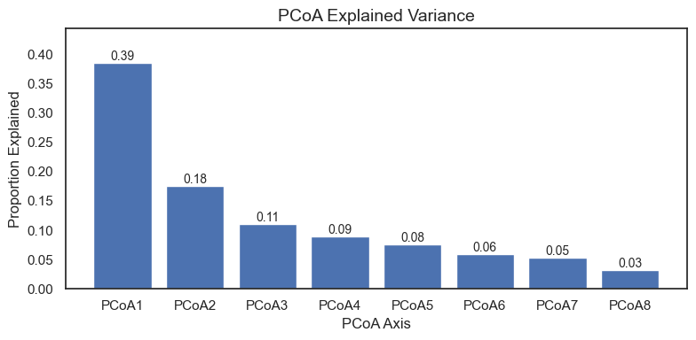
    


    
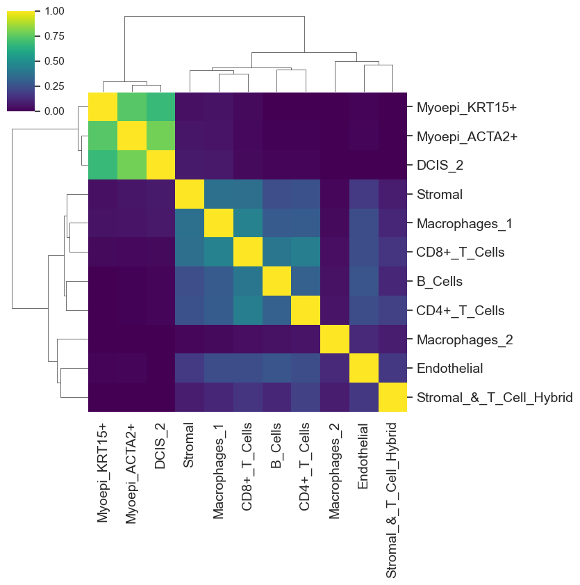
    


    <seaborn.matrix.ClusterGrid at 0x195360fd0>


```python
import anndata

bdata = anndata.AnnData(X=np.zeros((len(cell_df), 0)))  # Dummy X
bdata.obs = cell_df.copy()

# Store the coordinates used as the basis in adata.obsm
bdata.obsm["spatial"] = cell_df[["imagecol", "imagerow"]].to_numpy()

# draw
sc.pl.embedding(
    bdata,
    basis="spatial",
    color="Cluster",
    size=80,
    legend_loc=None,
    frameon=True,
    show=False,
)

ax = plt.gca()
ax.set_xlabel("X coordinate", fontsize=15)
ax.set_ylabel("Y coordinate", fontsize=15)
ax.tick_params(axis="both", labelsize=13)

# limit the range
ax.set_xlim(2400, 3400)
ax.set_ylim(2400, 3800)

# Align to the image coordinate system
ax.invert_yaxis()
ax.set_aspect("equal", adjustable="box")

legend = ax.legend(
    *ax.get_legend_handles_labels(),
    loc="center left",
    bbox_to_anchor=(1.02, 0.5),
    frameon=False,
    fontsize=12
)
plt.tight_layout()
plt.show()

```

    /Users/nomuraryosuke/miniconda3/envs/squidpy/lib/python3.9/site-packages/anndata/_core/anndata.py:859: UserWarning: 
    AnnData expects .obs.index to contain strings, but got values like:
        [1, 2, 3, 4, 5]
    
        Inferred to be: integer
    
      value_idx = self._prep_dim_index(value.index, attr)
    /Users/nomuraryosuke/miniconda3/envs/squidpy/lib/python3.9/site-packages/scanpy/plotting/_tools/scatterplots.py:1234: FutureWarning: The default value of 'ignore' for the `na_action` parameter in pandas.Categorical.map is deprecated and will be changed to 'None' in a future version. Please set na_action to the desired value to avoid seeing this warning
      color_vector = pd.Categorical(values.map(color_map))
    /Users/nomuraryosuke/miniconda3/envs/squidpy/lib/python3.9/site-packages/scanpy/plotting/_tools/scatterplots.py:394: UserWarning: No data for colormapping provided via 'c'. Parameters 'cmap' will be ignored
      cax = scatter(


    
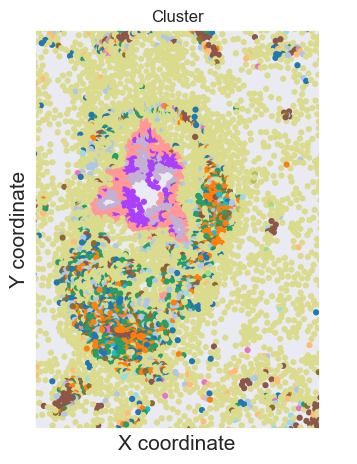
    


```python
import matplotlib.patches as mpatches

sc.pl.embedding(
    bdata,
    basis="spatial",
    color="Cluster",
    size=80,
    legend_loc="none",
    frameon=True,
    show=False,
)

ax = plt.gca()
ax.set_xlabel("X coordinate", fontsize=15)
ax.set_ylabel("Y coordinate", fontsize=15)
ax.tick_params(axis="both", labelsize=13)
ax.set_xlim(2400, 3400)
ax.set_ylim(2400, 3800)
ax.invert_yaxis()
ax.set_aspect("equal", adjustable="box")

# Retrieve category names and colors stored in adata
cats = bdata.obs["Cluster"].astype("category").cat.categories
colors = bdata.uns.get("Cluster_colors")

handles = [mpatches.Patch(color=c, label=str(cat)) for c, cat in zip(colors, cats)]
ax.legend(handles=handles, loc="center left", bbox_to_anchor=(1.02, 0.5), frameon=False, fontsize=12)

plt.subplots_adjust(right=0.80)
plt.tight_layout()
plt.show()

```

    /Users/nomuraryosuke/miniconda3/envs/squidpy/lib/python3.9/site-packages/scanpy/plotting/_tools/scatterplots.py:1234: FutureWarning: The default value of 'ignore' for the `na_action` parameter in pandas.Categorical.map is deprecated and will be changed to 'None' in a future version. Please set na_action to the desired value to avoid seeing this warning
      color_vector = pd.Categorical(values.map(color_map))
    /Users/nomuraryosuke/miniconda3/envs/squidpy/lib/python3.9/site-packages/scanpy/plotting/_tools/scatterplots.py:394: UserWarning: No data for colormapping provided via 'c'. Parameters 'cmap' will be ignored
      cax = scatter(


    
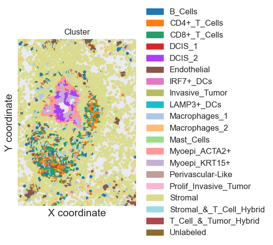
    


```python
# List of cluster categories
clusters = bdata.obs["Cluster"].astype("category").cat.categories

# Create a copy of adata and rename DCIS_2 → DCIS
bdata_renamed = bdata.copy()
bdata_renamed.obs["Cluster"] = (
    bdata_renamed.obs["Cluster"].replace({"DCIS_2": "DCIS"}).astype("category")
)

# Color settings: DCIS in yellow, others keep original colors
orig_cats = bdata.obs["Cluster"].astype("category").cat.categories
orig_colors = bdata.uns["Cluster_colors"]
color_dict = dict(zip(orig_cats, orig_colors))

cats = list(bdata_renamed.obs["Cluster"].cat.categories)
colors = []
for c in cats:
    if c == "DCIS":
        colors.append("#FFD700")
    else:
        orig_name = "DCIS_2" if c == "DCIS" and "DCIS_2" in orig_cats else c
        colors.append(color_dict.get(orig_name, "gray"))

bdata_renamed.uns["Cluster_colors"] = colors

# Plot "DCIS + each cluster" separately
for cluster in clusters:
    cluster_name = "DCIS" if cluster == "DCIS_2" else cluster

    plt.figure(figsize=(10, 10))
    sc.pl.spatial(
        bdata_renamed[bdata_renamed.obs["Cluster"].isin([cluster_name, "DCIS"])],
        img_key="hires",
        color="Cluster",
        size=1.5,
        spot_size=20,
        legend_loc="lower right",
        frameon=True,
        show=False,
    )

    ax = plt.gca()

    # Remove axis titles and labels
    ax.set_title("")
    ax.set_xlabel("")
    ax.set_ylabel("")
    ax.tick_params(axis="both", labelsize=11)

    # Manually construct legend for selected clusters
    handle_map = {cat: col for cat, col in zip(cats, bdata_renamed.uns["Cluster_colors"])}
    show_labels = [cluster_name, "DCIS"]
    show_labels = list(dict.fromkeys(show_labels))  # Remove duplicates for DCIS plots
    handles = [
        mpatches.Patch(color=handle_map[label], label=label)
        for label in show_labels
    ]
    ax.legend(handles=handles, loc="lower right", frameon=True, fontsize=12)

    ax.set_axis_on()

    # Set ROI limits
    ax.set_xlim(2400, 3400)
    # ax.set_xticks(range(2400, 3401, 200))
    ax.set_ylim(2400, 3800)
    # ax.set_yticks(range(2400, 3801, 200))

    # Align to image coordinate system
    ax.invert_yaxis()
    ax.set_aspect("equal", adjustable="box")

    # Save figure (optional)
    # plt.savefig(f"{root}/cell_location_fig/{cluster_name}_no_tick.png", dpi=300)

    plt.show()
    print(f"Figure: {cluster_name} + DCIS")

```

    /Users/nomuraryosuke/miniconda3/envs/squidpy/lib/python3.9/site-packages/anndata/_core/anndata.py:183: ImplicitModificationWarning: Transforming to str index.
      warnings.warn("Transforming to str index.", ImplicitModificationWarning)
    /var/folders/dv/s8n9gshs0qx43w0pr17qhmcm0000h_/T/ipykernel_99391/1044464550.py:7: FutureWarning: The behavior of Series.replace (and DataFrame.replace) with CategoricalDtype is deprecated. In a future version, replace will only be used for cases that preserve the categories. To change the categories, use ser.cat.rename_categories instead.
      bdata_renamed.obs["Cluster"].replace({"DCIS_2": "DCIS"}).astype("category")
    /Users/nomuraryosuke/miniconda3/envs/squidpy/lib/python3.9/site-packages/scanpy/plotting/_tools/scatterplots.py:1234: FutureWarning: The default value of 'ignore' for the `na_action` parameter in pandas.Categorical.map is deprecated and will be changed to 'None' in a future version. Please set na_action to the desired value to avoid seeing this warning
      color_vector = pd.Categorical(values.map(color_map))


    <Figure size 1000x1000 with 0 Axes>


    
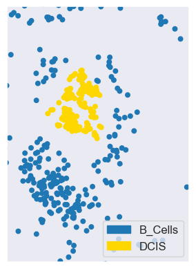
    


    Figure: B_Cells + DCIS


    /Users/nomuraryosuke/miniconda3/envs/squidpy/lib/python3.9/site-packages/scanpy/plotting/_tools/scatterplots.py:1234: FutureWarning: The default value of 'ignore' for the `na_action` parameter in pandas.Categorical.map is deprecated and will be changed to 'None' in a future version. Please set na_action to the desired value to avoid seeing this warning
      color_vector = pd.Categorical(values.map(color_map))


    <Figure size 1000x1000 with 0 Axes>


    
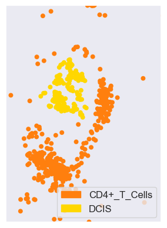
    


    Figure: CD4+_T_Cells + DCIS


    /Users/nomuraryosuke/miniconda3/envs/squidpy/lib/python3.9/site-packages/scanpy/plotting/_tools/scatterplots.py:1234: FutureWarning: The default value of 'ignore' for the `na_action` parameter in pandas.Categorical.map is deprecated and will be changed to 'None' in a future version. Please set na_action to the desired value to avoid seeing this warning
      color_vector = pd.Categorical(values.map(color_map))


    <Figure size 1000x1000 with 0 Axes>


    
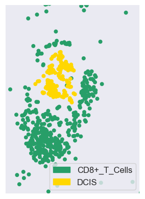
    


    Figure: CD8+_T_Cells + DCIS


    /Users/nomuraryosuke/miniconda3/envs/squidpy/lib/python3.9/site-packages/scanpy/plotting/_tools/scatterplots.py:1234: FutureWarning: The default value of 'ignore' for the `na_action` parameter in pandas.Categorical.map is deprecated and will be changed to 'None' in a future version. Please set na_action to the desired value to avoid seeing this warning
      color_vector = pd.Categorical(values.map(color_map))


    <Figure size 1000x1000 with 0 Axes>


    
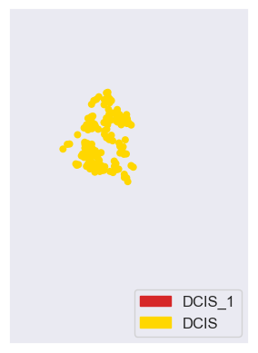
    


    Figure: DCIS_1 + DCIS


    /Users/nomuraryosuke/miniconda3/envs/squidpy/lib/python3.9/site-packages/scanpy/plotting/_tools/scatterplots.py:1234: FutureWarning: The default value of 'ignore' for the `na_action` parameter in pandas.Categorical.map is deprecated and will be changed to 'None' in a future version. Please set na_action to the desired value to avoid seeing this warning
      color_vector = pd.Categorical(values.map(color_map))


    <Figure size 1000x1000 with 0 Axes>


    

    


    Figure: DCIS + DCIS


    /Users/nomuraryosuke/miniconda3/envs/squidpy/lib/python3.9/site-packages/scanpy/plotting/_tools/scatterplots.py:1234: FutureWarning: The default value of 'ignore' for the `na_action` parameter in pandas.Categorical.map is deprecated and will be changed to 'None' in a future version. Please set na_action to the desired value to avoid seeing this warning
      color_vector = pd.Categorical(values.map(color_map))


    <Figure size 1000x1000 with 0 Axes>


    
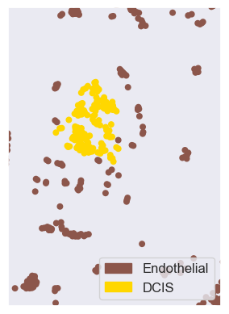
    


    Figure: Endothelial + DCIS


    /Users/nomuraryosuke/miniconda3/envs/squidpy/lib/python3.9/site-packages/scanpy/plotting/_tools/scatterplots.py:1234: FutureWarning: The default value of 'ignore' for the `na_action` parameter in pandas.Categorical.map is deprecated and will be changed to 'None' in a future version. Please set na_action to the desired value to avoid seeing this warning
      color_vector = pd.Categorical(values.map(color_map))


    <Figure size 1000x1000 with 0 Axes>


    
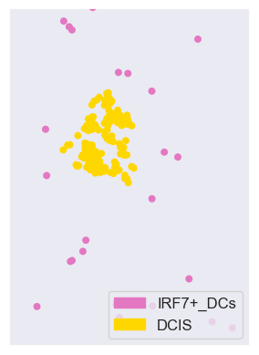
    


    Figure: IRF7+_DCs + DCIS


    /Users/nomuraryosuke/miniconda3/envs/squidpy/lib/python3.9/site-packages/scanpy/plotting/_tools/scatterplots.py:1234: FutureWarning: The default value of 'ignore' for the `na_action` parameter in pandas.Categorical.map is deprecated and will be changed to 'None' in a future version. Please set na_action to the desired value to avoid seeing this warning
      color_vector = pd.Categorical(values.map(color_map))


    <Figure size 1000x1000 with 0 Axes>


    
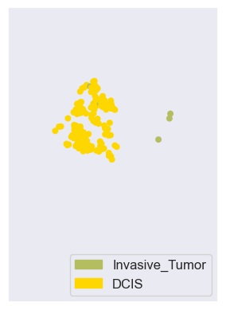
    


    Figure: Invasive_Tumor + DCIS


    /Users/nomuraryosuke/miniconda3/envs/squidpy/lib/python3.9/site-packages/scanpy/plotting/_tools/scatterplots.py:1234: FutureWarning: The default value of 'ignore' for the `na_action` parameter in pandas.Categorical.map is deprecated and will be changed to 'None' in a future version. Please set na_action to the desired value to avoid seeing this warning
      color_vector = pd.Categorical(values.map(color_map))


    <Figure size 1000x1000 with 0 Axes>


    
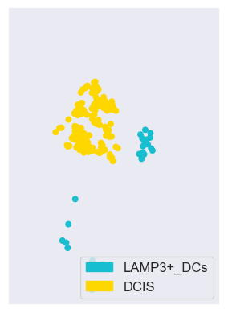
    


    Figure: LAMP3+_DCs + DCIS


    /Users/nomuraryosuke/miniconda3/envs/squidpy/lib/python3.9/site-packages/scanpy/plotting/_tools/scatterplots.py:1234: FutureWarning: The default value of 'ignore' for the `na_action` parameter in pandas.Categorical.map is deprecated and will be changed to 'None' in a future version. Please set na_action to the desired value to avoid seeing this warning
      color_vector = pd.Categorical(values.map(color_map))


    <Figure size 1000x1000 with 0 Axes>


    
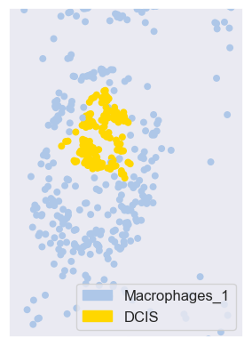
    


    Figure: Macrophages_1 + DCIS


    /Users/nomuraryosuke/miniconda3/envs/squidpy/lib/python3.9/site-packages/scanpy/plotting/_tools/scatterplots.py:1234: FutureWarning: The default value of 'ignore' for the `na_action` parameter in pandas.Categorical.map is deprecated and will be changed to 'None' in a future version. Please set na_action to the desired value to avoid seeing this warning
      color_vector = pd.Categorical(values.map(color_map))


    <Figure size 1000x1000 with 0 Axes>


    
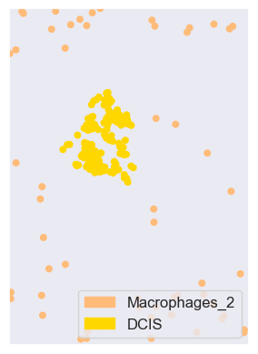
    


    Figure: Macrophages_2 + DCIS


    /Users/nomuraryosuke/miniconda3/envs/squidpy/lib/python3.9/site-packages/scanpy/plotting/_tools/scatterplots.py:1234: FutureWarning: The default value of 'ignore' for the `na_action` parameter in pandas.Categorical.map is deprecated and will be changed to 'None' in a future version. Please set na_action to the desired value to avoid seeing this warning
      color_vector = pd.Categorical(values.map(color_map))


    <Figure size 1000x1000 with 0 Axes>


    
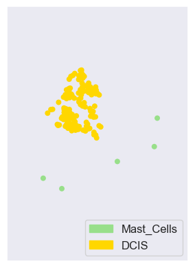
    


    Figure: Mast_Cells + DCIS


    /Users/nomuraryosuke/miniconda3/envs/squidpy/lib/python3.9/site-packages/scanpy/plotting/_tools/scatterplots.py:1234: FutureWarning: The default value of 'ignore' for the `na_action` parameter in pandas.Categorical.map is deprecated and will be changed to 'None' in a future version. Please set na_action to the desired value to avoid seeing this warning
      color_vector = pd.Categorical(values.map(color_map))


    <Figure size 1000x1000 with 0 Axes>


    
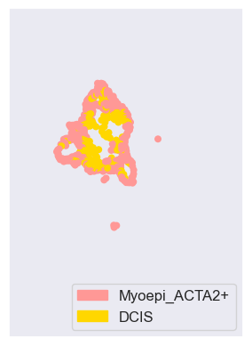
    


    Figure: Myoepi_ACTA2+ + DCIS


    /Users/nomuraryosuke/miniconda3/envs/squidpy/lib/python3.9/site-packages/scanpy/plotting/_tools/scatterplots.py:1234: FutureWarning: The default value of 'ignore' for the `na_action` parameter in pandas.Categorical.map is deprecated and will be changed to 'None' in a future version. Please set na_action to the desired value to avoid seeing this warning
      color_vector = pd.Categorical(values.map(color_map))


    <Figure size 1000x1000 with 0 Axes>


    
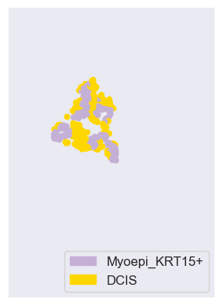
    


    Figure: Myoepi_KRT15+ + DCIS


    /Users/nomuraryosuke/miniconda3/envs/squidpy/lib/python3.9/site-packages/scanpy/plotting/_tools/scatterplots.py:1234: FutureWarning: The default value of 'ignore' for the `na_action` parameter in pandas.Categorical.map is deprecated and will be changed to 'None' in a future version. Please set na_action to the desired value to avoid seeing this warning
      color_vector = pd.Categorical(values.map(color_map))


    <Figure size 1000x1000 with 0 Axes>


    
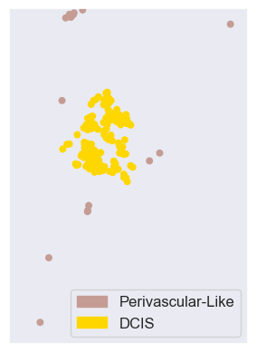
    


    Figure: Perivascular-Like + DCIS


    /Users/nomuraryosuke/miniconda3/envs/squidpy/lib/python3.9/site-packages/scanpy/plotting/_tools/scatterplots.py:1234: FutureWarning: The default value of 'ignore' for the `na_action` parameter in pandas.Categorical.map is deprecated and will be changed to 'None' in a future version. Please set na_action to the desired value to avoid seeing this warning
      color_vector = pd.Categorical(values.map(color_map))


    <Figure size 1000x1000 with 0 Axes>


    
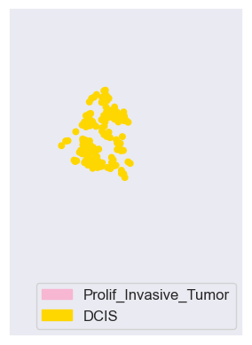
    


    Figure: Prolif_Invasive_Tumor + DCIS


    /Users/nomuraryosuke/miniconda3/envs/squidpy/lib/python3.9/site-packages/scanpy/plotting/_tools/scatterplots.py:1234: FutureWarning: The default value of 'ignore' for the `na_action` parameter in pandas.Categorical.map is deprecated and will be changed to 'None' in a future version. Please set na_action to the desired value to avoid seeing this warning
      color_vector = pd.Categorical(values.map(color_map))


    <Figure size 1000x1000 with 0 Axes>


    
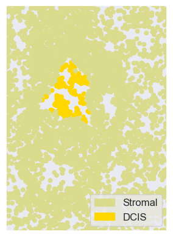
    


    Figure: Stromal + DCIS


    /Users/nomuraryosuke/miniconda3/envs/squidpy/lib/python3.9/site-packages/scanpy/plotting/_tools/scatterplots.py:1234: FutureWarning: The default value of 'ignore' for the `na_action` parameter in pandas.Categorical.map is deprecated and will be changed to 'None' in a future version. Please set na_action to the desired value to avoid seeing this warning
      color_vector = pd.Categorical(values.map(color_map))


    <Figure size 1000x1000 with 0 Axes>


    
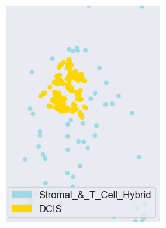
    


    Figure: Stromal_&_T_Cell_Hybrid + DCIS


    /Users/nomuraryosuke/miniconda3/envs/squidpy/lib/python3.9/site-packages/scanpy/plotting/_tools/scatterplots.py:1234: FutureWarning: The default value of 'ignore' for the `na_action` parameter in pandas.Categorical.map is deprecated and will be changed to 'None' in a future version. Please set na_action to the desired value to avoid seeing this warning
      color_vector = pd.Categorical(values.map(color_map))


    <Figure size 1000x1000 with 0 Axes>


    
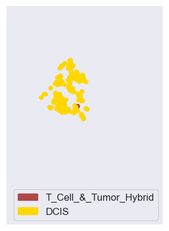
    


    Figure: T_Cell_&_Tumor_Hybrid + DCIS


    /Users/nomuraryosuke/miniconda3/envs/squidpy/lib/python3.9/site-packages/scanpy/plotting/_tools/scatterplots.py:1234: FutureWarning: The default value of 'ignore' for the `na_action` parameter in pandas.Categorical.map is deprecated and will be changed to 'None' in a future version. Please set na_action to the desired value to avoid seeing this warning
      color_vector = pd.Categorical(values.map(color_map))


    <Figure size 1000x1000 with 0 Axes>


    
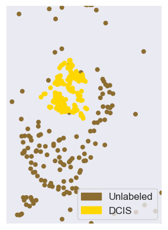
    


    Figure: Unlabeled + DCIS


